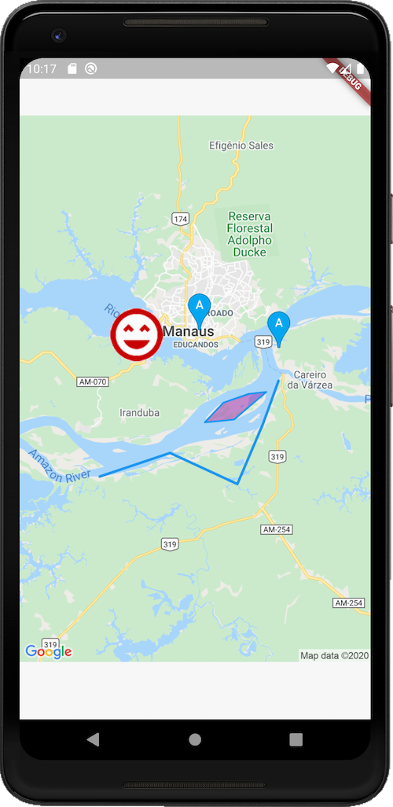

# google_static_maps_controller

[](https://codemagic.io/apps/5e70ce446e13eb493ea3b675/5e70ce446e13eb493ea3b674/latest_build)

The package provides simple and declarative access to the Google Static Maps service.

| Feature                 | Status |
| :---------------------- | :----: |
| Base Static map support |   ✅   |
| Zoom levels             |   ✅   |
| Image sizes             |   ✅   |
| Map types               |   ✅   |
| Markers                 |   ✅   |
| Map styles              |   ✅   |
| Paths                   |   ✅   |
| Encoded Polylines       |   ✅   |
| Viewports               |   ✅   |

✅ - done  
🧪 - experimental  
⚙️ - work in progress  
❌ - not yet implemented

## Getting Started

### Example map image



### source code:

```dart
// ***

  @override
  Widget build(BuildContext context) {
    return StaticMap(
      googleApiKey: "<REPLACE-WITH-GOOGLE-API-KEY>",
      width: MediaQuery.of(context).size.width,
      height: MediaQuery.of(context).size.height,
      scaleToDevicePixelRatio: true,
      zoom: 14,
      visible: const [
        GeocodedLocation.address('Santa Monica Pier'),
      ],
      styles: retroMapStyle,
      paths: <Path>[
        const Path(
          color: Colors.blue,
          points: [
            // Can be both, addresses and coordinates.
            GeocodedLocation.address('Santa Monica Pier'),
            Location(34.011395, -118.494961),
            Location(34.011921, -118.493360),
            Location(34.012471, -118.491884),
            Location(34.012710, -118.489420),
            Location(34.014294, -118.486595),
            Location(34.016630, -118.482920),
            Location(34.018899, -118.480087),
            Location(34.021314, -118.477136),
            Location(34.022769, -118.474901),
          ],
        ),
        Path.circle(
          center: const Location(34.005641, -118.490229),
          color: Colors.green.withOpacity(0.8),
          fillColor: Colors.green.withOpacity(0.4),
          encoded: true, // encode using encoded polyline algorithm
          radius: 200, // meters
        ),
        const Path(
          encoded: true,
          points: [
            Location(34.016839, -118.488240),
            Location(34.019498, -118.491439),
            Location(34.024106, -118.485734),
            Location(34.021486, -118.482682),
            Location(34.016839, -118.488240),
          ],
          fillColor: Colors.black45,
          color: Colors.black,
        )
      ],
      markers: const <Marker>[
        Marker(
          color: Colors.amber,
          label: "X",
          locations: [
            GeocodedLocation.address("Santa Monica Pier"),
            GeocodedLocation.latLng(34.012849, -118.501478),
          ],
        ),
        Marker.custom(
          anchor: MarkerAnchor.center,
          icon: "https://goo.gl/1oTJ9Y",
          locations: [
            Location(34.012343, -118.482998),
          ],
        ),
        Marker(
          locations: [
            Location(34.006618, -118.500901),
          ],
          color: Colors.cyan,
          label: "W",
        )
      ],
    );
  }

// ***
```

### StaticMapController
```dart
  Widget build(BuildContext context) {
    /// Declare static map controller
     const _controller = StaticMapController(
      googleApiKey: "<GOOGLE_API_KEY>",
      width: 400,
      height: 400,
      zoom: 10,
      center: Location(-3.1178833, -60.0029284),
    );

    /// Get map image provider from controller.
    /// You can also get image url by accessing
    /// `_controller.url` property.
    ImageProvider image = _controller.image;

    return Scaffold(
      body: Center(
        /// Display as a normal network image
        child: Image(image: image),
      ),
    );
  }
```
